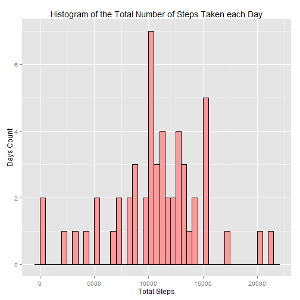
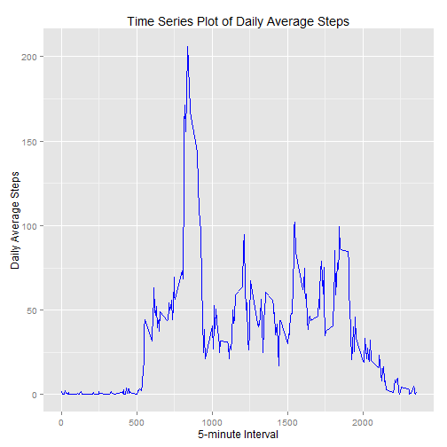
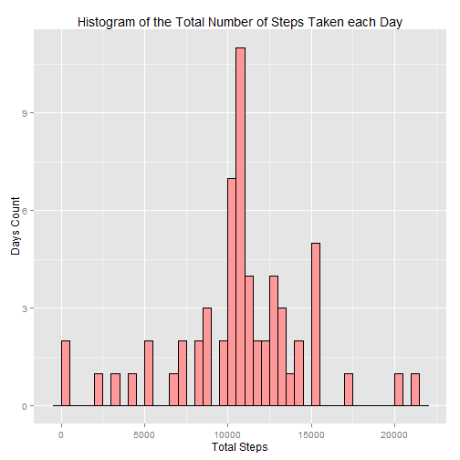
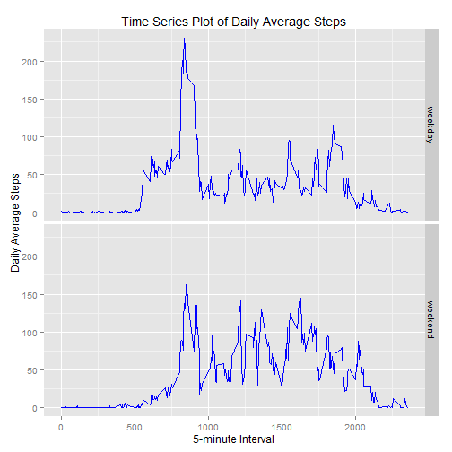

## Loading and preprocessing the data

1. Load the libraries needed for this assessment.

    
    ```r
    library(dplyr, warn.conflicts = FALSE)
    library(ggplot2)
    ```

2. Unzip the data set, load it, and convert the columns to the needed types.

    
    ```r
    unzip("activity.zip")
    raw.data <- read.csv("activity.csv",
                         colClasses=c("integer", "Date", "integer"))
    ```

## What is mean total number of steps taken per day?

1. Calculate the total number of steps taken per day and put the result in
   `total.steps.daily`. Note that missing values are filtered out.

    
    ```r
    total.steps.daily <- raw.data %>%
        filter(!is.na(steps)) %>%
        group_by(date) %>%
        summarise(total.steps = sum(steps))
    ```

2. Plot a histogram of the total number of steps taken each day. Note that
   the maximum happens in the range [10000, 10500) with 7 days count.

    
    ```r
    ggplot(data = total.steps.daily, aes(x = total.steps)) +
        geom_histogram(binwidth = 500, fill="#FF9999", color="black") +
        xlab("Total Steps") +
        ylab("Days Count") +
        ggtitle("Histogram of the Total Number of Steps Taken each Day")
    ```
    
     

3. Calculate and report the mean and median of the total number of steps
   taken per day.

    
    ```r
    mean(total.steps.daily$total.steps)
    ```
    
    ```
    ## [1] 10766.19
    ```
    
    ```r
    median(total.steps.daily$total.steps)
    ```
    
    ```
    ## [1] 10765
    ```

## What is the average daily activity pattern?

1. Calculate average steps taken day for each 5-minute interval. Note that
   missing values are filtered out.

    
    ```r
    average.daily <- raw.data %>%
        filter(!is.na(steps)) %>%
        group_by(interval) %>%
        summarise(average.steps = mean(steps))
    ```

2. Plot the 5-minute interval (x-axis) versus the average number of steps taken
   across all days (y-axis).

    
    ```r
    ggplot(data = average.daily, aes(x = interval, y = average.steps)) +
        geom_line(color="blue") +
        xlab("5-minute Interval") +
        ylab("Daily Average Steps") +
        ggtitle("Time Series Plot of Daily Average Steps")
    ```
    
     

3. Calculate and report the 5-minute interval containing the maximum number of
   steps.

    
    ```r
    average.daily$interval[which(average.daily$average.steps == max(average.daily$average.steps))]
    ```
    
    ```
    ## [1] 835
    ```

## Imputing missing values

1. Calculate and report the total number of missing values in the dataset.

    
    ```r
    sum(is.na(raw.data$steps))
    ```
    
    ```
    ## [1] 2304
    ```

2. Fill in all of the missing values in the dataset. The strategy use is to
   replace `NA`'s with the mean for that 5-minute interval averaged across all
   days. These are the same values calculated before in `average.daily`. The
   code assumes that `NA`'s exists for a whole day. It also verifies this in
   a verification step as explained below.

    
    ```r
    # Define a function that will only imput NA's
    imput.steps <- function(x) {
        # Only imput NA's that exists for a whole day.
        if (all(is.na(x$steps))) {
            mutate(x, steps = average.daily$average.steps)
        } else {
            x
        }
    }
    ```

3. Create a new dataset that is equal to the original dataset but with the
   missing data filled in.

    
    ```r
    imputed.data <- raw.data %>%
            group_by(date) %>%
            do(imput.steps(.)) %>% # Use the imput.step function defined above.
            ungroup()
    ```
   If we still have `NA`'s then the assumption above was wrong. Note that the
   `print()` function should never be executed and there should be no output
   from the below block.
   
    
    ```r
    if (any(is.na(imputed.data$steps))) {
        print("Something is wrong!") # Should never happen
    }
    ```

3. Calculate the total number of steps taken per day and put the result in
   `imputed.total.steps.daily`.

    
    ```r
    imputed.total.steps.daily <- imputed.data %>%
        group_by(date) %>%
        summarise(total.steps = sum(steps))
    ```

4. Make a histogram of the total number of steps taken each day and Calculate
   and report the mean and median total number of steps taken per day. Note
   that the maximum shifted to the range [10500, 11000) with more than 10 days
   count. Moreover, the mean was not affected but the median was.

    
    ```r
    ggplot(data = imputed.total.steps.daily, aes(x = total.steps)) +
        geom_histogram(binwidth = 500, fill="#FF9999", color="black") +
        xlab("Total Steps") +
        ylab("Days Count") +
        ggtitle("Histogram of the Total Number of Steps Taken each Day")
    ```
    
     
    
    ```r
    mean(imputed.total.steps.daily$total.steps)
    ```
    
    ```
    ## [1] 10766.19
    ```
    
    ```r
    median(imputed.total.steps.daily$total.steps)
    ```
    
    ```
    ## [1] 10766.19
    ```

## Are there differences in activity patterns between weekdays and weekends?

1. Create a new factor variable in the dataset with two levels `"weekday"` and
   `"weekend"` indicating whether a given date is a weekday or weekend day.
   This code assumes that the week end happens on Saturdays and Sundays.

    
    ```r
    as.weekdays <- function(x) {
        is.weekend <- weekdays(x, abbreviate = TRUE) %in% c("Sat", "Sun")
        factor(sapply(is.weekend, function(y) {
            if(y) {
                "weekend"
            } else {
                "weekday"
            }
        }))
    }
    weekdays.data <- imputed.data %>%
        mutate(day.type = as.weekdays(date)) %>%
        group_by(day.type, interval) %>%
        summarise(average.steps = mean(steps))
    ```

2. Plot the 5-minute interval (x-axis) versus the average number of steps taken
   across all weekday days or weekend days (y-axis). Note how there is more
   activities on average during the weekend.

    
    ```r
    ggplot(data = weekdays.data, aes(x = interval, y = average.steps)) +
        facet_grid(day.type ~ .) +
        geom_line(color="blue") +
        xlab("5-minute Interval") +
        ylab("Daily Average Steps") +
        ggtitle("Time Series Plot of Daily Average Steps")
    ```
    
     
